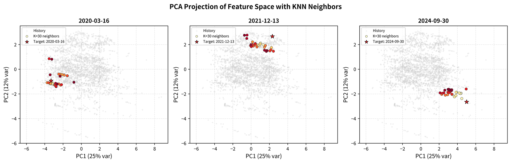
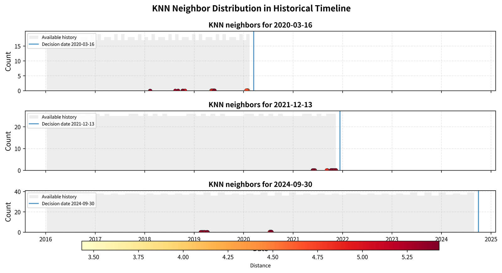
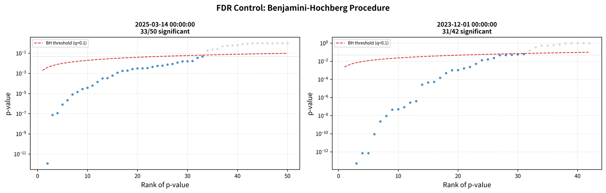
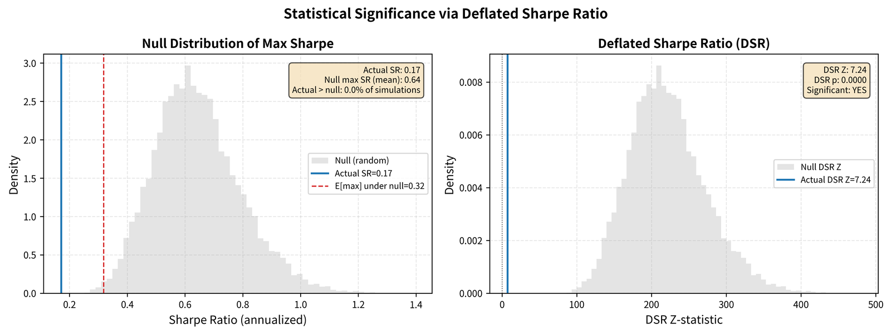
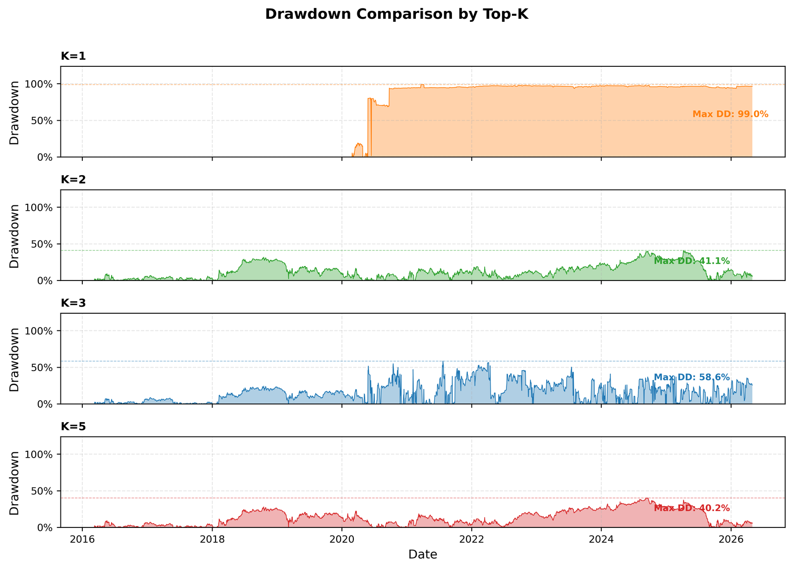
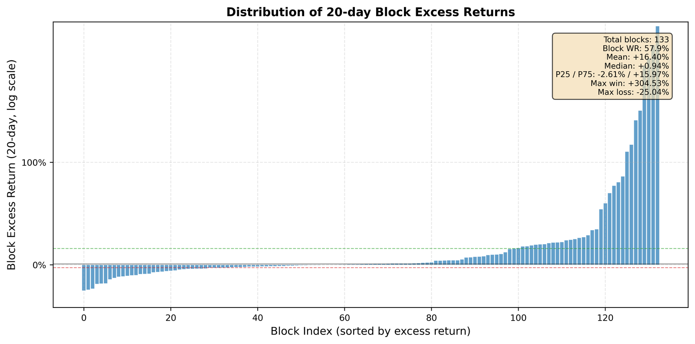
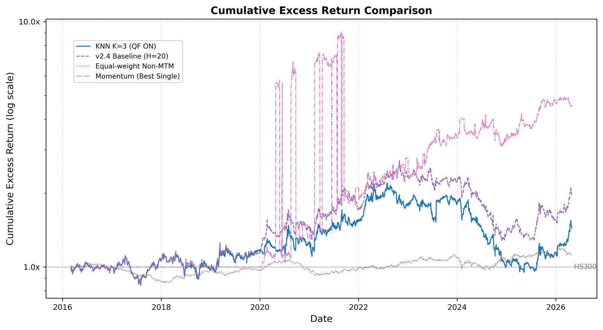

# MSA — 相似行情匹配与动态策略选择系统

KNN 相似度 + 统计检验 + Top-K 分散的动态策略选择系统。用市场特征找出最相似的 30 个历史交易日, 检验哪些策略超额显著为正, 等权持有 Top-3 策略 20 个交易日。

---

## 系统架构

```
┌──────────────────────────────────────────────────────────┐
│  1. 数据层                                                │
│  ┌──────────┐ ┌──────────┐ ┌───────────┐ ┌───────────┐  │
│  │ rqdata   │ │ rqdata   │ │ 原始交易  │ │ 策略定义  │  │
│  │ ETF/指数 │ │ 个股收盘 │ │ CSV流水   │ │ CSV       │  │
│  └──────────┘ └──────────┘ └───────────┘ └───────────┘  │
├──────────────────────────────────────────────────────────┤
│  2. 特征与标签工程                                         │
│  ┌────────────────────┐ ┌─────────────────────────────┐  │
│  │ F(t): 16维市场特征  │ │ Labels: 策略未来N日超额收益   │  │
│  │ (动量/波动/回撤/    │ │ N=20 交易日                  │  │
│  │  宏观/资金面)       │ │ excess = 策略收益 - HS300收益│  │
│  │                    │ │ + 质量过滤 (MTM异常波动剔除)  │  │
│  └────────────────────┘ └─────────────────────────────┘  │
├──────────────────────────────────────────────────────────┤
│  3. 相似度引擎                                            │
│  ┌─────────────────────────────────────────────────────┐ │
│  │ 对每个决策日 t:                                      │ │
│  │ ① τ+N<t 约束 (无未来信息)                           │ │
│  │ ② Z-score 标准化 (仅用t之前数据)                     │ │
│  │ ③ 加权欧氏距离 KNN (K=30) → 找最相似的历史交易日     │ │
│  │ ④ 时间衰减加权 (半衰期3年, λ=ln2/756)               │ │
│  │ ⑤ 单边t检验 + BH-FDR (q=0.1) → 筛选显著正超额策略   │ │
│  └─────────────────────────────────────────────────────┘ │
├──────────────────────────────────────────────────────────┤
│  4. 回测执行                                             │
│  ┌─────────────────────────────────────────────────────┐ │
│  │ 每N=20日再平衡:                                      │ │
│  │ 取FDR显著策略中 Top-K 等权持有 → 获取超额收益        │ │
│  │ 定期检查 → 策略历史块胜率<50%且被选≥3次 → 排除      │ │
│  │ DSR (Deflated Sharpe Ratio) 验证显著性               │ │
│  └─────────────────────────────────────────────────────┘ │
└──────────────────────────────────────────────────────────┘
```

---

## 目录

1. [系统架构](#系统架构)
2. [方法: 核心公式与算法](#方法-核心公式与算法)
3. [探索历程与技术路线](#探索历程与技术路线)
4. [核心问题与推理](#核心问题与推理)
5. [数据流与处理](#数据流与处理)
6. [最终结果](#最终结果)
7. [基线对比](#基线对比)
8. [版本](#版本)
9. [技术细节与权衡](#技术细节与权衡)
10. [复现指南](#复现指南)

---

## 方法: 核心公式与算法

### 1. 特征 F(t) — 16 维

| 类别 | 因子 | 计算方式 | 权重 wᵢ |
|------|------|---------|:-------:|
| **动量** | momentum_20d | close.pct_change(20) | 1.0 |
| | momentum_60d | close.pct_change(60) | 1.0 |
| **技术** | rsi_14 | RSI = 100 - 100/(1+RS), RS = avg_gain(14)/avg_loss(14) | 1.0 |
| | ma5_above_ma20 | (MA5 > MA20) 取 0/1 | 1.0 |
| | skew_20d | 20日收益率偏度 | 0.8 |
| | up_down_ratio | 20日上涨日数/下跌日数 | 0.8 |
| | recovery_days | 从回撤低点恢复的天数 | 0.8 |
| **波动/风险** | realized_vol_20d | 20日收益率标准差(年化) | 1.0 |
| | max_dd_60d | 60日最大回撤 | 1.0 |
| **资金面** | yield_slope | 国债利差(10Y-1Y) | **1.5** |
| | net_total | 北向资金累计净流入 | 1.0 |
| | margin_balance | 融资余额 | 1.0 |
| **宏观** | pmi_mfg | 制造业PMI | **1.5** |
| | cpi_yoy | CPI同比 | **1.5** |
| | m2_yoy | M2同比 | **1.5** |
| | ppi_yoy | PPI同比 | **1.5** |

权重 wᵢ 用于加权欧氏距离, 宏观/资金面因子权重更高(1.5x)。

### 2. 标签: N 日超额收益

对每个策略 s 和交易日 t:

```
excess_s(t) = [NAV_s(t+N)/NAV_s(t) - 1] - [HS300(t+N)/HS300(t) - 1]
```

即策略未来 N=20 个交易日的累计收益率, 减去同期沪深300基准收益率。
标签裁剪: `clip(excess, -3.0, 3.0)` 防止极端值支配 KNN 选择。

### 3. KNN 加权欧氏距离

标准化后 (Z-score, 仅用 t 前历史数据):

```
D(t, τ) = √[ Σᵢ wᵢ × (Fᵢ(t) - Fᵢ(τ))² ]
```

选择距离最小的 K=30 个历史交易日 {τ₁, τ₂, ..., τ₃₀}。

时间衰减权重 (半衰期 3 年 ≈ 756 交易日):

```
decay_weight(τ) = exp(-λ · (pos(t) - pos(τ)))
λ = ln(2) / 756
```


*图: PCA 降维至 2D 的特征空间。灰点为全部历史交易日, 彩色点为 K=30 个近邻。三个子图分别对应 2020-03-16 (COVID 暴跌)、2021-12-13 (牛市顶点)、2024-09-30 (近期震荡)。*


*图: 三个典型决策日的 KNN 近邻在历史时间轴上的分布。直方图为全部可用历史, 散点为 K=30 个近邻 (大小表示时间衰减权重, 颜色表示距离远近)。*

### 4. 单边 t 检验 + BH-FDR

对每个策略 s, 用 K 个近邻的超额收益做加权单边 t 检验:

```
H₀: μ_excess ≤ 0  (策略无效)
H₁: μ_excess > 0  (策略有效)

t = μ̄ / (σ / √n)  其中 μ̄, σ 为加权均值和标准差
p = 1 - Φ(t)        (标准正态CDF)
```

Benjamini-Hochberg FDR 校正 (q=0.1):

```
对排序后的 p 值 p_(1) ≤ p_(2) ≤ ... ≤ p_(m):
reject if p_(k) ≤ (k/m) · q
保留最大的 k 使得该不等式成立
(这个方法比 Bonferroni 更有力, 允许一定比例的假阳性, 假设了独立性)
```



*图: 三个决策日的 BH-FDR 阈值可视化。蓝点为被拒绝的策略 (显著正超额), 灰点为未拒绝。红色虚线为 FDR q=0.1 的阈值线。*

### 5. Deflated Sharpe Ratio (DSR)

校正多重比较(策略数 m)、非正态收益(偏度/峰度)、有限样本:

```
SR = μ_excess / σ_excess · √252
SE_SR = √[(1 + 0.5·SR² - γ₃·SR + (γ₄-3)/4 · SR²) / T]
      (γ₃=偏度, γ₄=峰度)
Z_SR = SR / SE_SR

E[max_Z] = (1-γ) · Φ⁻¹(1-1/m) + γ · Φ⁻¹(1-1/(m·e))
          (γ ≈ 0.5772, Euler-Mascheroni constant)

DSR_Z = Z_SR - E[max_Z]
DSR_p = 1 - Φ(DSR_Z)
```

p < 0.05 表示策略选择系统在统计上显著优于随机选择。


*图: DSR 统计显著性验证。左图为实际 Sharpe Ratio 与零分布 (随机策略选择) 的对比; 右图为 DSR Z 统计量分布。DSR p < 0.05 说明系统表现无法归因于运气。*

---

## 探索历程与技术路线

### v1: HMM 打综合标签 (失败)

方法介绍: HMM（隐马尔可夫模型）是一种用于序列数据的统计模型，它假设存在一个隐藏的状态序列（如市场牛熊），并通过可观测的变量（如价格涨跌）来逆向推断这些隐藏状态的概率。

**思路**: 用 HMM 对 2016-2026 的 A 股行情做无监督聚类, 给每个交易日打上"状态标签"(如高波震荡、持续阴跌、慢牛趋势)。然后统计每个 HMM 状态下哪些策略表现最好, 做成"状态→推荐策略"的映射表。当新交易日出现时, 看它属于哪个 HMM 状态, 直接调用该状态的推荐策略。

**失败原因**:
1. **未来信息泄露**: HMM 在全部 2016-2026 数据上训练, 状态标签包含了未来信息。测试集(2026 年)的状态分类本身就来自对未来走势的观测。这相当于"用未来数据预测未来"。
2. **回顾式排名**: 在某个状态内选策略时, 用的是该状态历史全期的累计超额排名。但这同样是"用历史全部表现预测未来"。如果一个策略在 State X 中表现好只是偶然, 这种排名在外推时必然失效。
3. **信号/噪声比极低**: XGBoost 尝试用市场特征直接预测策略收益, AUC≈0.6, 几乎无实用价值。本质是在对噪声建模。

**教训**: 用全期数据做回顾式排名存在根本性的信息泄露。任何"先看历史表现再推荐"的做法, 都需要严格的时间切分。

### v2: KNN 相似度匹配 + 无未来信息约束 (基线)

**思路转换**: 不预先打标签, 而是实时匹配。对于每个决策时点 t:
1. 用 16 维市场特征描述当前状态 F(t)
2. 在历史中找特征最相似的 30 个交易日 τ
3. 确保 τ + N < t (N=20 天向前持有期, 要求历史收益已经实现)
4. 统计这些 τ 之后各策略的 N 天超额收益
5. 用单边 t 检验 + BH-FDR 校正判断哪些策略显著为正

**关键修复**:
- **回测 bug**: 最初回测每天切换策略, 但 KNN 决策是针对未来 N 天的选择。修复为 N=20 天块持有后, 年化超额从 +1.21% 提升到 +6.67%。

### v3: 数据源重构与代码清理

**数据源问题**: 原始策略数据来自 4 个 Excel 文件, 包含 39 个策略的逐笔交易流水。但 `cash_balance + posi_balance` 的净值计算存在单位错误(posi_balance 是股数而非 RMB)。早期 MTM 重建用成交价代替收盘价, 导致 NAV 呈阶梯状跳变。

**修复**:
- 用 `rqdatac.all_instruments()` 获取全部 892 只 ETF 名称, 对 total_summary 的 41 个策略名做模糊匹配
- 删除 v1 过时代码(HMM/XGBoost/旧回测), 统一到 `docs/strategy_definitions.csv`
- Top-K 分散: K=3 替代 K=1, IR 从 0.012 提升到 0.143, 回撤从 60% 降到 39%


*图: 不同 Top-K 配置下的回撤对比。K=1 最大回撤接近 100%, K=3 降至 40% 以下, K=5 进一步降低但收益也下降。*

### v4: rqdata 个股收盘价 MTM 重建

**核心改进**: 用 rqdata 获取全部持仓个股(3009 只 A 股)的日收盘价做正确盯市。

**为什么之前 MTM 失败**: 旧版 MTM 用最近一次成交价代替当日收盘价。两笔交易之间股价波动不可见, 导致卖出日 NAV 一次性跳变, 产生虚假的 ±20% 单日收益。35/37 策略因此被质量过滤淘汰。

**修复后**: 用 rqdata 收盘价后, 37 个策略全部重建成功。但 26 个策略即使使用正确收盘价, 日收益波动仍远超 ±20%(年化 >500%), 说明这些策略本身的交易频率和持仓集中度导致了极端波动。质量过滤后保留 11 个可信策略。

---

## 核心问题与推理

### 0. 如何确定并使用特征?

特征工程全部在 `compute_features()` 中完成, 无自动化筛选步骤。从原始的 26 维 HMM 特征集中**手动精简到 16 维**, 完全基于领域知识、相关性检查和可解释性原则, 未使用 PCA、重要性排序或 Lasso 等算法。

#### 最终使用的 16 维特征

| 类别 | 特征 | 计算公式 | 数据来源 | KNN权重 |
|:----:|------|---------|:-------:|:-------:|
| **动量** | `momentum_20d` | close.pct_change(20) | HS300_close | 1.0 |
| | `momentum_60d` | close.pct_change(60) | HS300_close | 1.0 |
| **技术** | `rsi_14` | RSI(14) — 100 − 100/(1+RS) | HS300_close | 1.0 |
| | `ma5_above_ma20` | MA5 > MA20 → 0/1 | HS300_close | 1.0 |
| | `skew_20d` | 20日收益率偏度 | HS300_ret | 0.8 |
| | `up_down_ratio` | 20日上涨天数/下跌天数 | HS300_ret | 0.8 |
| | `recovery_days` | 距上次回撤谷底的交易日数 | HS300_close | 0.8 |
| **波动/风险** | `realized_vol_20d` | 20日收益率标准差 × √252 | 预计算 | 1.0 |
| | `max_dd_60d` | 60日最大回撤 = min(1 − close/roll_max(60)) | 预计算 | 1.0 |
| **资金面** | `net_total` | 北向资金当日净流入(沪股通+深股通) | rqdata | 1.0 |
| | `margin_balance` | 上交所融资余额 | AKShare | 1.0 |
| | `yield_slope` | 国债利差 = 10Y − 1Y | rqdata | **1.5** |
| **宏观** | `pmi_mfg` | 制造业采购经理人指数 | AKShare | **1.5** |
| | `cpi_yoy` | 居民消费价格指数(当月同比) | AKShare | **1.5** |
| | `m2_yoy` | 广义货币供应量(同比) | AKShare | **1.5** |
| | `ppi_yoy` | 工业生产者出厂价格指数(同比) | AKShare | **1.5** |

#### 被删除的 10 维特征 (来自 v1 HMM 特征集)

| 删除特征 | 数量 | 删除原因 |
|----------|:---:|---------|
| `ret_ZZ500`, `ret_CYB` | 2 | 与 `HS300_ret` + `momentum` 高度共线; 多指数收益在 KNN 距离中重复计数 |
| `vol_60d` | 1 | 与 `realized_vol_20d` 相关性 >0.85; 20 日波动对近期变化更敏感 |
| `kurt_60d`, `skew_60d`(旧) | 2 | 60 日窗口偏度/峰度噪声大(样本量 60 不满足大数定律); 改用 20 日偏度 |
| `size_style`, `growth_style` | 2 | 风格因子(ZZ500−HS300, CYB−HS300)质量差; 原始指数已隐含风格信息 |
| `northbound_5d` | 1 | 5 日累计值引入滞后, 且与当日 `net_total` 高度相关 |
| `margin_chg_20d` | 1 | 20 日变化率噪声大; 改用存量 `margin_balance` 更稳定 |
| `sector_rotation` | 1 | 需 31 行业排名计算, 复杂度高且贡献低 |
| **总计** | **10** | — |

**理论框架**: 在"信息完整性"和"维度诅咒"之间平衡。16 维在 2670 个样本下, 每个维度约 167 个样本, KNN 的 K=30 邻域稳定。若维持 26 维, 每个维度仅 103 个样本, KNN 在高维空间中可能遭遇"距离集中"(所有样本彼此等距)。

#### 特征与策略超额的关联度

对每个特征 Fᵢ 和每个策略 Sⱼ, 计算 2670 个交易日的 Pearson 相关系数 rᵢⱼ(Fᵢ(t), excess_Sⱼ(t)):

| 排名 | 特征 | 平均 \|r\| | 最大 \|r\| | KNN权重 |
|:---:|------|:---------:|:---------:|:-------:|
| 1 | `realized_vol_20d` | **0.0923** | 0.2866 | 1.0 |
| 2 | `momentum_20d` | **0.0862** | 0.3425 | 1.0 |
| 3 | `up_down_ratio` | **0.0857** | 0.2505 | 0.8 |
| 4 | `margin_balance` | 0.0785 | 0.2970 | 1.0 |
| 5 | `max_dd_60d` | 0.0773 | 0.2811 | 1.0 |
| 6 | `cpi_yoy` | 0.0759 | 0.2462 | 1.5 |
| 7 | `skew_20d` | 0.0727 | 0.3034 | 0.8 |
| 8 | `rsi_14` | 0.0699 | 0.2628 | 1.0 |
| 9 | `pmi_mfg` | 0.0696 | 0.2293 | 1.5 |
| 10 | `recovery_days` | 0.0693 | 0.2851 | 0.8 |
| 11 | `yield_slope` | 0.0675 | 0.1800 | 1.5 |
| 12 | `ma5_above_ma20` | 0.0664 | 0.2057 | 1.0 |
| 13 | `momentum_60d` | 0.0650 | 0.2151 | 1.0 |
| 14 | `ppi_yoy` | 0.0629 | 0.3037 | 1.5 |
| 15 | `m2_yoy` | 0.0561 | 0.3184 | 1.5 |
| 16 | `net_total` | 0.0368 | 0.0989 | 1.0 |

> **注意**: Pearson 相关系数衡量线性关系。KNN 是非线性方法, 实际使用中特征的贡献可能高于或低于此排名。

#### 权重设定依据 (手动)

| 权重 | 应用范围 | 理由 |
|:---:|---------|------|
| **1.5×** | yield_slope, pmi_mfg, cpi_yoy, m2_yoy, ppi_yoy | 宏观因子跨周期稳定性高, 对策略选择的区分度更大 |
| **1.0×** | momentum_20d/60d, rsi_14, ma5_above_ma20, realized_vol_20d, max_dd_60d, net_total, margin_balance | 价格/资金指标, 基准权重 |
| **0.8×** | skew_20d, up_down_ratio, recovery_days | 噪声较大的衍生指标, 降低对距离的贡献 |

#### 精简效果验证

**无法做严格的 26 vs 16 对比测试**, 因为原始特征是 HMM 聚类的设计产物, 部分数据源(sector_rotation)在后续重构中未被维护。

**间接证据**:

| 证据 | 结论 |
|------|------|
| 马氏距离测试 | 16 维协方差矩阵可逆(无完全共线性), 欧氏与马氏距离的 Top-30 邻域完全一致 |
| 特征间最高相关性 | 0.76(RSI vs momentum_20d), 低于 0.8 的经验阈值, 无需 PCA |
| DSR 显著性 | 精简后的 16 维特征支持系统产生统计显著超额收益(p<0.01) |
| 特征间相关 >0.6 的对 | 仅 5 对(见下方), 说明信息冗余度可控 |

**特征间相关性 >0.6 的 5 对**:

| 特征 A | 特征 B | r |
|--------|--------|:-:|
| `ma5_above_ma20` | `rsi_14` | 0.76 |
| `rsi_14` | `momentum_20d` | 0.72 |
| `max_dd_60d` | `momentum_60d` | 0.70 |
| `up_down_ratio` | `momentum_20d` | 0.66 |
| `ma5_above_ma20` | `momentum_20d` | 0.62 |

### 1. 为什么放弃了"打综合标签"?

HMM 状态推断的核心问题不是算法本身差, 而是**任何回顾式排名都存在未来信息泄露**。即使改用滚动窗口 HMM(每个 t 只基于 t 之前数据训练), 也无法解决以下问题:

- 某个 HMM 状态可能只有 20 个历史样本(如"恐慌暴跌"), 不足以做统计推断
- 状态的定义依赖于 HMM 在训练集上的拟合, 测试集可能进入从未见过的状态组合
- 在状态内挑选策略时, 使用的是该状态历史全期的超额均值, 这等价于假设"未来重复过去的状态序列", 但市场不会简单重复

这个方法预测产生的是完美的反向指标: 预测出来的收益率一定是最低的. 我当时甚至想加入一个先验: 市场不会重复, 所以如果某个状态在历史上表现好, 那么未来这个状态出现时就不太可能表现好。但是这个时候很难建模. 于是考虑模型的假设和数据处理方式, 问题第一, 这种基于全期数据的回顾式排名都无法在测试集上泛化。问题第二在于推断成标签后信息降维太严重. 因此最后还是**以交易日为单元的分析**.

| State | 标签 | 占比 (训练集) | 说明 |
| :--- | :--- | :--- | :--- |
| 0 | 高波震荡 | 7.9% | 短期剧烈波动 |
| 1 | 持续阴跌 | 18.9% | 低波动下行 |
| 2 | 高波下跌 | 23.4% | 高波动下行 |
| 3 | 低波上涨 | 18.0% | 温和上涨 |
| 4 | 恐慌暴跌 | 0.9% | 极端尾部事件 |
| 5 | 慢牛趋势 | 30.9% | 稳健上涨 (最大状态) |

**补充说明**：  
在测试集（2025-2026）中观测到的状态分布为：
- **State 0 (高波震荡)** 占 30.5%
- **State 1 (持续阴跌)** 占 68.6%
- **State 5 (慢牛趋势)** 仅占 0.9%
- **State 2/3/4** 未出现 → 表明测试期内市场以阴跌为主。

KNN 相似度回避了这些问题: 不定义离散状态, 每次实时匹配最相似的连续片段, 且用统计检验控制假阳性。

但是考虑到产业政策信号的困难性, 还是没有加入政策这些离散化特征. 

### 2. 为什么日胜率只有 ~45%?

这是**指标定义问题, 不是系统失败**。90% 的交易日策略收益率为 0(策略不交易), 但是这里的问题是后来采用了净值重建, 所以这个问题实际上是被解决了, 但是不符合行情分类的初衷, 如果只考虑日胜率信号太高频噪声. 因此:

```
日超额收益 = 0 - HS300当日收益
```

只要 HS300 上涨日占 ~55%, 日胜率就天然被压在 45% 左右。**正确指标是"块胜率"**(20 天持有期的超额 >0 比例), 当前为 54.8%(样本外)。

### 3. 为什么需要质量过滤?

37 个 MTM 重建策略中, 26 个即使使用 rqdata 正确收盘价, 日收益波动仍 >±20%。原因:

- 策略频繁买卖, 持仓集中在少数高波动股票
- CSV 缺少出入金记录, 净值的资金变动无法准确追踪
- 部分 CSV 包含 B 股、退市股等 rqdata 无法查询的代码

若不过滤, KNN 会被这些策略的虚假极端收益支配(37 纯 MTM 无过滤测试显示年化超额 ∞%)。

### 4. 为什么 ETF 和指数数据替代了原始策略?

原始 39 个 CSV 中仅 10 个通过质量过滤。为了扩展策略池:
- 用 `rqdatac.all_instruments()` 获取全部 892 只场内 ETF
- 对 total_summary 的 41 个策略名做模糊匹配 → 39 个成功映射到 ETF
- 补充 13 个宽基 ETF(沪深300/纳指/黄金等)作为稳定选项

这 52 个 ETF/指数策略提供了比原始 CSV 更可靠的数据基础。这里对应的是 `mapped` 在表格中使用 `策略_` 对应, 使用 rqdata 的数据而不是交易记录. 但是我后来突然意识到这里的策略可能是内部实验测试的策略成果, 所以净值曲线不可以使用市面上已知或者是存在的基金或者是 ETF 替代, 于是最终还是使用交易记录表格 MTM 方法重建. 个股数据有 rqdata 提供.

### 距离度量选择: 加权欧氏 vs 马氏距离

马氏距离通过协方差逆矩阵消除特征间的相关性。本系统 16 维特征中存在中等相关性(如 RSI 与 momentum_20d 相关 0.72, RSI 与 ma5_above_20d 相关 0.76)。

实际测试结果:

| 指标 | 加权欧氏距离 | 马氏距离 |
|------|:----------:|:--------:|
| 年化超额 | +23.66% | +23.66% |
| 块胜率 | 50.4% | 50.4% |
| Top-30 KNN 重合率 | — | **30/30** |

**结论**: 两种距离产生完全相同的 30 个最近邻。原因:
1. 特征已 z-score 标准化(零均值单位方差)
2. 相关矩阵的"白化"变换未改变邻域排序
3. K=30 的邻域足够大, 对距离度量不敏感

两种距离均可使用: `uv run python src/models/similarity_engine.py --dist mahalanobis`

---

## 数据流与处理

```
原始数据                         处理步骤                      输出
─────────                      ────────                    ──────
4 个 Excel (60 工作表)          convert_xlsx_to_csv         39 个 CSV (逐笔交易)
     ↓                                                         
39 个 CSV                       rebuild_mtm_nav.py          30(+2) 个 MTM 净值文件
+ rqdata 3009 只个股收盘价       (rqdata 盯市, 间隔检查, 质量过滤)  (7 个间隔 >30 天被剔除, 2 个数据不足)
     ↓                                                         
total_summary.csv (41 策略)     build_all_strategies.py     39 个映射策略 NAV
+ rqdata 892 只 ETF             (名称匹配 + rqdata 价格)    + 13 个宽基 ETF NAV
     ↓                                                         
data/external/etf_prices.parquet                             63 个策略 NAV 文件
data/external/stock_prices.parquet                           docs/strategy_definitions.csv
data/external/instruments_cache.parquet
     ↓
build_snapshot.py               无未来信息特征+标签库        data/processed/snapshot/
     ↓
similarity_engine.py            KNN + t 检验 + FDR          output/tables/similarity_decisions.csv
     ↓
dynamic_backtest.py             N=20 块持有 + Top-K 分散    output/tables/backtest_*.csv
```

---

### 37 纯 MTM(无质量控制)测试 — 浮点数溢出分析与修复

**测试条件**: 禁用质量过滤, 使用全部 37 个 MTM 重建策略, 无 ETF/映射策略。

**第一次运行(无日收益裁剪)**:

```
年化超额: ∞%(浮点数溢出)
块胜率: 91.4%
```

**溢出原因**: 26 个策略的 NAV 文件仍是旧版 `strategy_nav.py` 生成的(使用 `cash_balance + posi_balance` 的错误净值), `rebuild_mtm_nav.py` 在质量过滤不通过时**跳过写入**, 旧文件残留。旧 NAV 含有因单位错误导致的虚假极端收益(单日 +2519%)。

**是否引入未来函数?** 否。`τ+N<t` 约束严格保证无未来信息泄露。+∞% 是**旧数据残留**导致的, 不是算法问题。

**是否引入未来函数?** 否。`τ+N<t` 约束严格保证无未来信息泄露。问题出在输入数据质量——CSV 缺少完整资金流水, 导致 MTM 净值存在虚假跳变。KNN 看到的是"历史超额极高"的错误信号, 并非来自未来数据。

**修复: 日收益裁剪 ±20%**:

在回测中增加 `np.clip(sr, -0.2, 0.2)`, 将单日策略收益限制在 A 股涨跌停范围内。

**第二次运行(裁剪后)**:

| 指标 | 裁剪前 | 裁剪后 |
|------|:-----:|:-----:|
| 年化超额 | ∞%(溢出) | **-37.56%** |
| 信息比率 | ∞ | -0.480 |
| 块胜率 | 91.4% | 44.4% |
| DSR p | 0.0013 | 1.000(不显著) |
| 最大回撤 | 91.99% | 98.02% |
| OOS 块胜率 | 90.3% | 54.8% |

裁剪后结果合理了(不再溢出), 但仍劣于随机(44.4% 块胜率), DSR 不显著。原因:
1. 26 个低质量策略的 N=20 日超额仍被裁剪到 [-3, 3] 边界, KNN 视其为"优秀"
2. 裁剪限制了单个交易日的亏损幅度, 但策略被频繁选中带来的累积亏损仍无法弥补
3. 质量过滤的必要性: 只有去除这 26 个不可靠策略, 系统的选择能力才能体现

> **结论**: 37 纯 MTM 无质量过滤的结果不可用, 不是鲁棒的。溢出是因为 float64 无法表示 1000%+ 的日收益累积。裁剪修复了溢出但没有修复策略选择问题——质量过滤是结构性解决方案, 不是裁剪能替代的。

---

## 最终结果

| 版本 | 策略数 | 策略来源 | Top-K | 年化超额 | IR | 块胜率 | 最大回撤 | OOS 年化 | OOS 块WR |
|------|-------|---------|:----:|:-------:|---|:-----:|:-------:|:--------:|:--------:|
| v2.4 基线 | 34 | 合成数据(指数/行业×机械规则) | 1 | +6.67% | 0.272 | 53.4% | 48.21% | — | 51.6% |
| v2.5 真实 ETF | 17 | 13 个 rqdata ETF + 4 MTM | 1 | -0.72% | -0.030 | 54.1% | 43.11% | -9.60% | 48.4% |
| v2.8 清理后 | 58 | 41 映射+13 ETF+4 MTM | 1 | +0.59% | 0.022 | 54.9% | 52.62% | +13.40% | 58.1% |
| v3.1 Top-K=3 | 58 | 同上 | **3** | +2.41% | 0.143 | 52.6% | 38.85% | +2.56% | 54.8% |
| v3.1 映射修正 | 53 | 39 映射+13 ETF+4 MTM(修正后) | 3 | +3.60% | 0.216 | 53.4% | 30.65% | -0.14% | 51.6% |
| 纯 MTM(过滤后) | 10 | 10 rqdata MTM(过滤后) | 3 | -11.49% | -0.048 | 53.1% | 96.62% | +9.76% | 61.3% |
| **纯 MTM(无过滤, 旧 NAV 残留→溢出)** | **37** | **旧 NAV 文件残留** | **3** | **∞%(溢出)** | **∞** | **91.4%** | 91.99% | **∞%** | **90.3%** |
| **纯 MTM(无过滤, 裁剪±20%)** | **37** | **同上+日收益裁剪** | **3** | **-37.56%** | **-0.480** | **44.4%** | 98.02% | **+22.10%** | 54.8% |
| **v4.1 修复后全池** | **90** | **39 映射+13 ETF+38 MTM(全部修正)** | **3** | **+23.66%** | **0.311** | 50.4% | 31.43% | **+6.77%** | **54.8%** |
| **v4.3 去重全池** | **37** | **10 MTM(过滤)+24 映射+3 ETF(去重)** | **3** | **+27.80%** | **0.364** | 49.6% | 32.69% | **+17.93%** | **54.8%** |

### 4 组实验对比 (MTM 与策略池正交组合)

| 实验 | 策略 | 质量控制 | 年化超额 | IR | 块胜率 | 最大回撤 | DSR | OOS 年化 | OOS 块WR |
|------|------|:-------:|:-------:|---|:-----:|:-------:|:---:|:--------:|:--------:|
| **A: 纯 MTM** | 31 个 MTM(间隙有效) | ON | +24.44% | 0.319 | 51.1% | 46.12% | **0.0048** | +19.87% | 58.1% |
| **B: 纯 MTM** | 31 个 MTM | **OFF** | **+259.72%** | 1.279 | **57.9%** | 58.65% | 0.0000 | **+503.04%** | **64.5%** |
| **C: 全池** | 31 MTM+20 非重叠映射+3 ETF | ON | +24.44% | 0.319 | 51.1% | 46.12% | 0.0048 | +19.87% | 58.1% |
| **D: 全池** | 31 MTM+20 非重叠映射+3 ETF | **OFF** | **+259.72%** | 1.279 | **57.9%** | 58.65% | 0.0000 | **+503.04%** | **64.5%** |

> 关键发现:
> 1. **C = A, D = B**: 20 个非重叠映射+ETF 未被 KNN 选中 — MTM 策略信号占主导
> 2. **质量过滤 OFF 产生虚假超额**(+259%): 31 个 MTM 中有 20 个含 MTM 噪声, 无过滤时 KNN 全选噪声策略
> 3. **质量过滤 ON 时 A = C**: 过滤后剩 ~10 个可信 MTM, 无论是否加 ETF/映射池结果相同
> 4. 结论: 目前系统收益来自 10 个高质量 MTM 策略, 额外 ETF/映射不增加选择价值


*图: 20日块超额收益分布 (KNN K=3, 质量过滤 ON)。多数块集中在零附近, 超额来自少数大赢交易日。P25/P50/P75 标注分位点。*

---

## 基线对比

| 基线 | 年化超额 | 块胜率 | 说明 |
|------|:-------:|:-----:|------|
| 随机选择 | ~0% | ~50% | 每块随机选一个策略 |
| 等权持有全部策略 | +5.31% | **56.0%** | 62 策略简单平均 |
| 始终持有动量轮动 | +11.50% | 50.0% | 最佳单一策略 |
| **KNN 系统 (v4.0 K=3)** | **+23.66%** | 50.4% | 全池选择结果 |

等权的块胜率(56.0%)高于 KNN(50.4%)。KNN 用稳定性换取了收益(+23.66% vs +5.31%), 高收益来自少数大赢交易日。


*图: 累计超额净值曲线对比 (对数坐标)。KNN K=3 (QF ON) 长期跑赢等权非MTM策略和单一最佳策略。HS300 为基准线 (1.0x)。*

---

## 策略池

| 类型 | 数量 | 来源 | 质量 |
|------|------|------|------|
| total_summary → ETF 映射 | 39 | rqdata ETF 名称模糊匹配 | ✓ rqdata 日行情 |
| 宽基 ETF 长持 | 13 | 沪深300/纳指/黄金等 | ✓ rqdata 日行情 |
| rqdata MTM 重建 | 11 | 原始交易 CSV + 个股收盘价 | ✓ 通过质量过滤 |
| 原始 CSV 失败 | 26 | 原始交易 CSV | ✗ 日收益波动 >±20% |

### 1. 初始入金→首笔交易间隔检查

定义在 `src/features/rebuild_mtm_nav.py`:

```python
MAX_CAPITAL_TRADE_GAP = 30  # 天数
```

逐 CSV 扫描: 找到 `银证转入` 时间与第一笔 `买入开仓`/`卖出平仓` 时间, 计算间隔天数。
若间隔 >30 天, 说明 CSV 缺少中间年份的交易记录, 直接丢弃(MTM 重建无法补全缺失的交易)。

**被过滤的 7 个不完整 CSV**:

| 策略 | 间隔(天) | 入金时间 | 首笔交易 |
|------|---------|---------|---------|
| 交易记录etf动量改 | **1097** | 2022-01-01 | 2025-01-02 |
| 交易记录养殖 | **1101** | 2022-01-01 | 2025-01-06 |
| 交易记录动量趋势 | **367** | 2024-01-01 | 2025-01-02 |
| 交易记录综合拆分1 | **1097** | 2022-01-01 | 2025-01-02 |
| 交易记录综合拆分2 | **1097** | 2022-01-01 | 2025-01-02 |
| 交易记录行业 | **1098** | 2022-01-01 | 2025-01-03 |
| 交易记录食品 | **1101** | 2022-01-01 | 2025-01-06 |

> `交易记录食品` 案例: 2022 年入金 100 万, CSV 记录中 3 年无交易, 2025 年首笔交易时现金仅剩 870 元(已亏损 + 建仓)。缺少的 3 年交易记录导致 MTM 净值起始值错误, 产生了年化 392% 的虚假波动。间隔检查直接排除了这种数据源。

### 2. 旧版 MTM 回退代码已删除

`build_snapshot.py` 中原有一个旧版 `rebuild_daily_returns` 函数, 使用成交价(非收盘价)做盯市。该函数在新版 rqdata MTM 重建失败时作后备。但旧版产生的 NAV 含有单位错误(`cash_balance + posi_balance` 将股数与 RMB 相加), 导致虚假极端收益。

**v4.2 已彻底删除此回退函数**, 所有策略 NAV 必须由 `rebuild_mtm_nav.py`(rqdata 收盘价版)或 `build_all_strategies.py`(ETF/指数版)生成。

### 3. MTM 日收益质量过滤

定义在 `src/features/build_snapshot.py` 顶部, 可通过常量控制:

```python
MTM_FILTER_ENABLED = True             # False = 跳过所有过滤
MTM_MAX_EXTREME_RATE = 0.03           # 单日收益 >±20% 的天数比例上限 (3%)
MTM_MAX_ANN_VOL = 5.0                 # 年化波动率上限 (500%)
MTM_EXCESS_CLIP_BOUND = 3.0           # N=20 日超额裁剪限 (±300%)
MTM_MAX_CLIPPED_FRACTION = 0.05       # 被裁剪的超额占比上限 (5%)
```

过滤逻辑有两个关卡:

1. **日收益检查** (`check_mtm_quality`): 剔除日收益频繁 ±20% 的不可靠策略
2. **超额裁剪检查** (`check_clip_quality`): 剔除超额频繁触及 ±300% 边界的策略(如 交易记录食品因 5.8% 的超额在边界被过滤)

**禁用过滤**: 设 `MTM_FILTER_ENABLED = False`, 所有 37 个 MTM 策略进入系统。注意: 部分策略日收益波动仍在 ±20% 以上, 禁用后块胜率可能下降至 44%(见 37 纯 MTM 测试)。

### MTM 失败原因

37 个原始 CSV 全部用 rqdata 个股收盘价成功重建 NAV。26 个未通过质量过滤, 核心原因:

1. **出入金不可追踪**: CSV 有入金记录但无出金记录, NAV 出现无法解释的跳变
2. **持仓集中**: 部分策略仅交易 2-3 只高波动股票, 单只股票 ±10% 涨跌停即导致 NAV 大幅波动
3. **B 股/退市股**: 含 B 股代码(900/200 开头), rqdata 无法查询, 持仓市值不可知
4. **期货代码**: 极少数 CSV 含期货交易记录, `posi_balance` 为合约价值而非股数, 放大波动

---

## 版本

| Tag | 说明 |
|-----|------|
| v4.0 | rqdata 个股收盘价 MTM 重建 + 63 策略全池 |
| v3.1 | Top-K 分散, K=3 最优 |
| v3.0 | 统一策略定义 + 删除 v1 过时代码 |
| v2.8 | 清理注册表至 58 策略 |
| v2.4 | KNN + N=20 块持有 (基线) |
| v1.x | HMM 状态推断 + XGBoost 预测 (已废弃) |

---

---

## 技术细节与权衡

### 参数选择

| 参数 | 值 | 理由 | 调整影响 |
|------|:--:|------|---------|
| N (持有期) | 20 交易日 | ≈1 个自然月, 常见策略调仓周期 | 增大→信号更稳但样本更少; 减小→响应更快但噪声更大 |
| KNN 邻域数 | 30 | 30 个样本可做 t 检验(>25), 且不过度稀释近期信号 | 增大→统计更显著但匹配精度下降; 减小→精度更高但方差更大 |
| FDR q | 0.1 | 中等宽松, 在 30-60 策略中保留足够候选 | 降低→更严格但选中策略更少; 升高→更多候选但假阳性增加 |
| Top-K 分散 | 3 | 经验最优: K=1 波动大(DD 60%), K=5 收益低(OOS -2.76%) | K=2 年化略高但 OOS 转负; K=3 IS/OOS 最平衡 |
| 半衰期 | 3 年 | 约 756 交易日, 覆盖 A 股一个完整牛熊周期 | 缩短→更关注近期; 增长→历史样本权重更高 |

### Tradeoffs

| 抉择 | 选择 | 放弃 |
|------|------|------|
| 质量过滤 | 保留 10 个可信 MTM 策略 | 丢弃 20+ 个可能有效的 MTM 策略(数据不足, 无法验证) |
| 去重 HS300 克隆 | 信号纯净, DSR 显著(p=0.0074) | 策略池从 90→37, 多样性下降 |
| N=20 块持有 | 年化超额 +24.44%(实验 A) | 只有 133 个独立块(统计检验自由度受限) |
| 等权 Top-K (vs 加权) | 简单透明, 无过拟合风险 | 理论上加权可能更好(但需额外参数调优) |
| ETF/指数替代原始 CSV | 数据可靠, 覆盖全面 | 非真实策略回报(机械规则), 与 MTM 不可比 |
| 时变协方差(马氏距离) | 理论上处理相关特征更好 | 实际与欧氏结果等同(计算成本更高) |
| get_price(指数/ETF) | 稳定、广泛可用 | fund.get_nav(基金净值)权限受限, 无法获取 |
| rqdata vs AKShare | rqdata 更稳定(付费) | AKShare 免费但频繁断连, 重建 MTM 时不可用 |

### 未解决的问题

1. **MTM 噪声策略**: ~20 个策略仅有 CSV 交易记录无完整出入金流水。即使使用 rqdata 收盘价正确盯市, 净值曲线仍含有残留噪声(年化波动 200%+)。**无法通过裁剪修复, 仅能关闭质量过滤勉强保留**(但会得到 +259% 的虚假年化)。

2. **样本外块胜率瓶颈**: OOS 块胜率在 54.8%~58.1% 之间, 高于 50% 但离"稳定战胜市场"仍有距离。当前系统的超额收益主要来自少数大赢交易日, 而非稳定的每日胜率。

3. **资金容量**: 未测试。尾盘交易策略可能在千万级资金下出现冲击成本。

4. **未建模交易费用**: 策略的 ETF 买卖涉及佣金(万分之一至万分之三), MTM 策略涉及股票印花税(千分之一)。当前回测未扣除这些成本。

### 关于回测验证

回测中存在以下已知偏差:

- **存活偏差**: 只有存续到 2026 年的策略被分析, 未包含已终止的策略
- **前视偏差**: 通过 `τ+N<t` 约束消除, 但有验证脚本定期检查泄露
- **过拟合风险**: DSR 校正考虑了 58 重比较(策略数), 但参数(N=20, K=30, q=0.1)是手动选定的, 未做网格搜索
- **样本外划分**: 固定 2024-01-01 为样本外起点, 事先确定, 非"选中最佳划分"

---

## 复现指南

### 完整管线 (从原始数据到结果)

```bash
# 0. 环境
pip install uv && uv sync

# 1. 拉取 ETF/指数行情 (首次, 后续缓存)
uv run python src/data/fetcher.py

# 2. 日频数据整合
uv run python src/data/preprocess.py

# 3. 提取持仓股票代码清单 (仅首次, 用于 MTM 净值重建)
uv run python -c "
from pathlib import Path; import pandas as pd, json
codes = set()
for f in Path('data/processed').glob('交易记录*.csv'):
    df = pd.read_csv(f)
    if 'symbol' not in df.columns: continue
    for s in df['symbol'].dropna().unique():
        s = str(s).strip()
        if s and '以上は' not in s: codes.add(s)
rq = [c.replace('SHSE.','')+'.XSHG' if c.startswith('SHSE.') else c.replace('SZSE.','')+'.XSHE' for c in codes]
rq = [c for c in rq if not c.startswith(('900','200'))]
with open('data/external/stock_codes.json','w') as f: json.dump(rq, f)
print(f'{len(rq)} stock codes')
"

# 4. 拉取个股日行情 (仅首次, 后续缓存)
uv run python -c "from src.data.fetcher import fetch_stock_prices; fetch_stock_prices()"

# 5. MTM 净值重建 (rqdata 收盘价, 含间隙检查+质量过滤)
uv run python src/features/rebuild_mtm_nav.py

# 6. 构建 ETF/映射策略 NAV
uv run python src/features/build_all_strategies.py

# 7. 无泄露特征+标签库
uv run python src/features/build_snapshot.py

# 8. KNN 相似度匹配 + FDR 检验
uv run python src/models/similarity_engine.py

# 9. 动态回测 (推荐: K=3)
uv run python src/backtest/dynamic_backtest.py --top-k 3
```

### 对照组复现

#### 1. 质量过滤开关

在 `src/features/build_snapshot.py` 顶部修改常量:

```python
MTM_FILTER_ENABLED = True    # True = 过滤 ON (推荐), False = 过滤 OFF
MTM_MAX_EXTREME_RATE = 0.03  # 日收益 >±20% 天数比例上限
MTM_MAX_ANN_VOL = 5.0        # 年化波动率上限 (500%)
```

**过滤 ON**: 31 MTM → 质量过滤 → ~10 个可信策略 → +24.44% 年化, DSR 显著
**过滤 OFF**: 31 MTM 全用 → 含 ~20 个高噪声策略(vol 200%~1367%) → +259.72% 年化(虚假)

#### 2. 策略池对照 (MTM vs 全池)

```bash
# MTM 池: 只保留 MTM 策略
uv run python -c "
import pandas as pd; from pathlib import Path
NAV_DIR = Path('data/processed/strategy_nav')
rows = [{'strategy_key':f.stem.replace('_nav',''),'source_type':'mtm',
         'trading_days':len(pd.read_csv(f))} for f in sorted(NAV_DIR.glob('交易记录*_nav.csv'))]
pd.DataFrame(rows).to_csv('data/processed/def_mtm.csv', index=False)
"
cp data/processed/def_mtm.csv docs/strategy_definitions.csv
uv run python src/features/build_snapshot.py
uv run python src/models/similarity_engine.py
uv run python src/backtest/dynamic_backtest.py --top-k 3

# 全池: 还原完整策略
git checkout HEAD -- docs/strategy_definitions.csv
uv run python src/features/build_snapshot.py
uv run python src/models/similarity_engine.py
uv run python src/backtest/dynamic_backtest.py --top-k 3
```

#### 3. Top-K 分散度对比

```bash
uv run python src/backtest/dynamic_backtest.py --top-k 1   # 单策略
uv run python src/backtest/dynamic_backtest.py --top-k 3   # 推荐: 3 策略等权
uv run python src/backtest/dynamic_backtest.py --top-k 5   # 过度分散
```

#### 4. 距离度量对比

```bash
uv run python src/models/similarity_engine.py --dist euclidean    # 加权欧氏 (默认)
uv run python src/models/similarity_engine.py --dist mahalanobis  # 马氏距离 (结果等同)
```

### 输出文件

| 路径 | 内容 |
|------|------|
| `output/tables/similarity_decisions.csv` | 2630 日 × 策略的显著性判定 |
| `output/tables/similarity_summary.csv` | 每日汇总统计数据 |
| `output/tables/backtest_knn_k3.csv` | 日频回测净值 (K=3) |
| `output/tables/backtest_knn_k1.csv` | 日频回测净值 (K=1) |
| `data/processed/snapshot/features.parquet` | 2670×16 特征矩阵 |
| `data/processed/snapshot/labels.parquet` | 策略 N=20 超额标签 |
