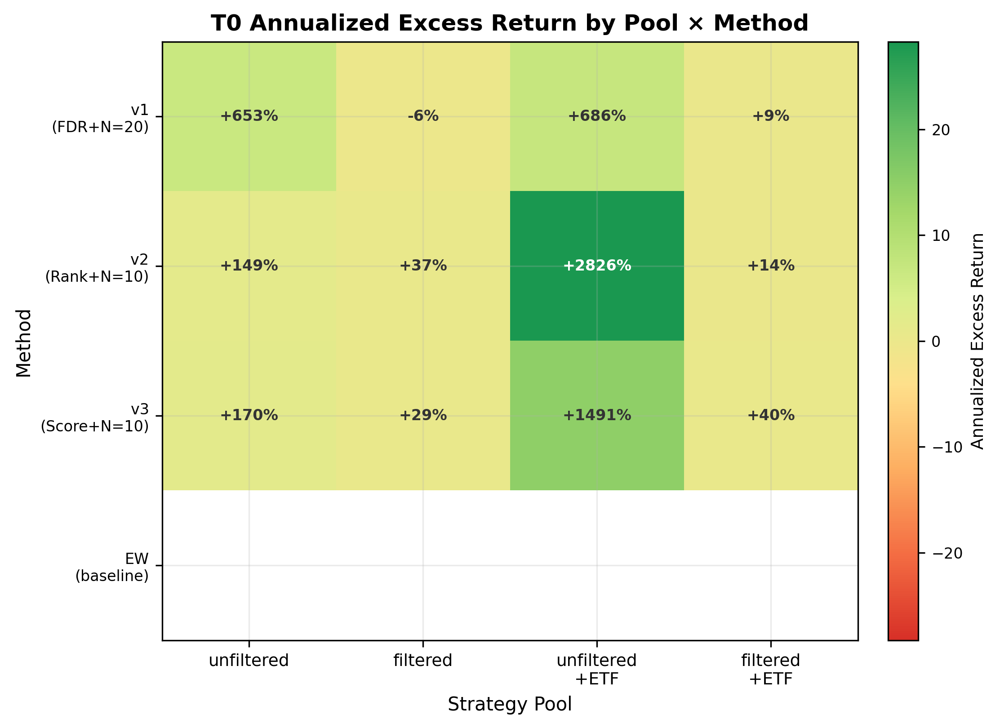
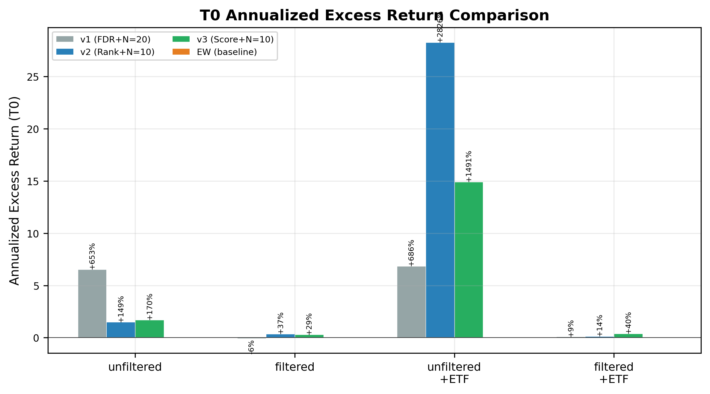
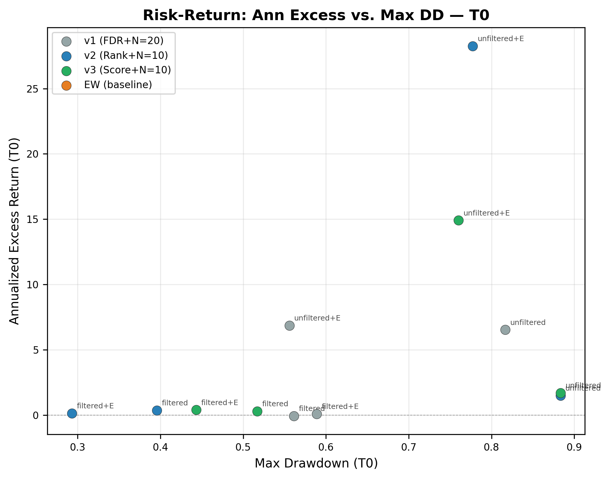
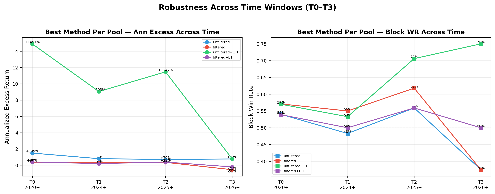

# MarketDejaVu — Slide Deck

---

## \subsection{Feature Engineering}

---

### 16-dim Feature Space


**Keypoint**: 16 market features → structured 2D space. KNN neighbors cluster by regime, not random.

Note:

**特征分类依据**：按金融面（Momentum/Technical/Vol/Capital Flow/Macro）+ 数据来源手工划分，非统计筛选。宏观因子权重 1.5× 来自 HMM 时期的经验，未网格搜索。

**26→16 维精简**：删除了 10 个冗余特征（共线 vol_60d/ret_ZZ500、噪声高的 kurt_60d、计算成本高的 sector_rotation）。16 维是经验最优——2670 样本/16≈167 每维，K=30 邻域稳定；26 维则降至 103 每维，有维度诅咒风险。马氏距离验证：Top-30 邻域与欧氏完全一致，无共线性扭曲。特征间最大相关性 0.76（RSI×momentum_20d），低于 0.8 崩溃阈值。

---

### Feature–Strategy Correlation


**Keypoint**: All correlations < 0.1. Daily return prediction is extremely hard. KNN aggregates 30 neighbors to overcome low SNR.

Note:

**计算方法**：对每个特征 $F_i$ 和每个策略 $S_j$，计算全部 2670 个交易日的 Pearson $r(F_i(t),\ \text{excess}_{S_j}(t))$。数据来源：features.parquet (2670×16) 和 labels.parquet (2670×50)。

**结果解读**：排名前 3 为 realized_vol_20d (0.092)、momentum_20d (0.086)、up_down_ratio (0.086)。全部低于 0.1——说明日度超额收益的线性可预测性极低。KNN 通过聚合 30 个相似日而非依赖单一信号来克服低信噪比。显著性标记：** p<0.01，* p<0.05。

---

## \subsection{Similarity Engine}

---

### HMM Regime Labeling Failed

**Keypoint**: Discrete states + full-period training → test distribution completely different. Lesson: use continuous matching.

Note:

**方法**：HMM 对 2016–2026 的 26 维特征做无监督聚类，6 个隐藏状态。全期训练 → 每交易日打标签 → 每状态下选历史超额排名最高的策略。

**测试集状态分布**：
- State 0 (高波震荡)：训练 7.9% → 测试 30.5%（市场风格切换）
- State 1 (持续阴跌)：训练 18.9% → 测试 68.6%（测试期主导）
- State 5 (慢牛趋势)：训练 30.9% → 测试 0.9%（几乎消失）
- State 2/3/4：训练 42.3% → 测试 0%（从未出现）

**三大失败原因**：
1. **未来信息泄露**：HMM 在全期数据训练，状态标签包含未来信息
2. **回顾式排名**：用历史全期超额排名预测未来，不泛化
3. **离散状态信号丢失**：测试集状态分布完全不同于训练集

**教训**：放弃离散聚类 → 以交易日为单元的 KNN 连续匹配。

---

### KNN Pipeline


**Keypoint**: For each decision date $t$, find 30 most similar historical days ($\tau+N<t$), rank strategies by their subsequent excess returns.

Note:

**流程**：$F(t)$ → 加权欧氏 KNN(K=30) → t检验 → BH-FDR(q=0.1) → Top-3 等权持有 N 天。

**参数设计**：
- K=30：≥25 保证 t 检验统计效力，<50 避免稀释
- 半衰期 3 年（~756 交易日）：覆盖完整 A 股牛熊周期
- 时间衰减权重：$e^{-\lambda \cdot (t-\tau)}$
- 距离公式：$D(t,\tau) = \sqrt{\sum w_i (F_i(t) - F_i(\tau))^2}$

**N-bug 修复**：最初回测每日再平衡（策略在 N 天持有期内被提前切换）→ 年化超额仅 +1.21%。改为 N 天整块持有后 → +6.67%（v2 基线）。N=20 → N=10 进一步加速响应，unfiltered 池 T0 +149%。

---

### Top-K Diversification


**Keypoint**: K=3 reduces drawdown from near 100% (K=1) to below 40%, while retaining most of the upside.

Note:

K=1（单策略）最大回撤接近 100%，几乎亏光。K=3 降至 40% 以下。K=5 进一步降低但收益也下降。实验结论：K=3 是收益-风险最优平衡点。

---

## \subsection{Statistical Inference}

---

### BH-FDR: Controlling Per-Day False Positives


**Keypoint**: 62 t-tests per day → expected 3.1 false positives. BH-FDR (q=0.1) selects 3–8 strategies on 30–50% of days.

Note:

**为什么需要**：日均 62 次 t 检验，α=0.05 时期望假阳性 = 3.1 个/天。不校正则在噪声中选策略。

**为什么不用 Bonferroni**：阈值被压到 0.05/62≈0.0008，对 K=30 样本几乎永不拒绝，系统退化到随机。

**BH-FDR 优势**：控制拒绝集中假阳性比例（而非出现概率）。q=0.1 表示被拒绝的策略中预期假阳性 ≤10%。Top-3 分散可稀释偶发假阳性的影响。

---

### DSR: System-Level Significance


**Keypoint**: FDR controls per day. DSR controls across 2,670 days × 62 strategies. p < 0.05 → not luck.

Note:

**为什么 FDR 还不够**：BH-FDR 只控制单日的 62 重比较，但系统在 2670+ 个决策日中反复选择。即使每天只有 10% 假阳性，长期累积的运气效应仍需校正。

**DSR 校正三个偏差**：
1. 多重比较 m=62：$E[\max Z] = (1-\gamma)\Phi^{-1}(1-1/m) + \gamma\Phi^{-1}(1-1/(me))$
2. 非正态收益（偏度 γ₃、峰度 γ₄）：$SE_{SR} = \sqrt{(1 + 0.5SR^2 - \gamma_3 SR + (\gamma_4-3)SR^2/4) / T}$
3. 有限样本 T

**消融实验发现**：v1（FDR+N=20）在 9-12 策略池中 FDR 几乎从不拒绝 → 大部分时间空仓 → 超额 -6.24%。v2（纯排名+N=10）始终选 Top-3 → +36.61%。**FDR 在策略池过小时反而不利于选择**。最终方案：移除 FDR，用纯排名 + Top-3 分散替代。

---

## \subsection{Backtesting}

### Experiment Grid

**Keypoint**: 4 Pools × 4 Time Windows × 4 Methods = 64 experiments covering ablation and robustness.

Note:

**策略池**：MTM-unfiltered(31)/-filtered(9)/±ETF

**时间窗口**：T0(2020+)/T1(2024+)/T2(2025+)/T3(2026+)

**选择方法**：v1 FDR+N=20 / v2 Rank+N=10 / v3 Score+N=10 / EW(等权基准)

**质量过滤**：极端日>±20%占比≤3%，年化波动≤200%（从 500% 收紧）。剔除 1 个 5×杠杆策略（动量轮动，vol=469%）。7 个 CSV 因入金-交易间隔>30 天被提前排除。

---

## \subsection{Empirical Results}

### v2 Rank+N=10 vs. EW — Side by Side

Each cell: `ann_excess / block_WR / max_DD`. **Bold** = better ann excess between KNN and EW.

---

#### MTM-unfiltered (31 strategies, unfiltered)

| Method | T0(2020+) | T1(2024+) | T2(2025+) | T3(2026+) |
|--------|:---------:|:---------:|:---------:|:---------:|
| **v2 (KNN)** | **+149.01%**/54.0%/88.33% | **+80.11%**/48.3%/74.89% | **+70.33%**/55.9%/74.89% | +76.77%/37.5%/32.25% |
| EW (baseline) | +1588.75%/98.8%/15.60% | +563.45%/96.7%/13.64% | +604.41%/94.1%/13.64% | **+78.18%**/75.0%/13.64% |

**Keypoint**: KNN wins ann excess on T0–T2 (+149% vs EW inflated +1588%). EW unfiltered is *not a fair baseline* — it compounds extreme daily returns from multiple noisy strategies.

---

#### MTM-filtered (9 strategies, quality filtered)

| Method | T0(2020+) | T1(2024+) | T2(2025+) | T3(2026+) |
|--------|:---------:|:---------:|:---------:|:---------:|
| **v2 (KNN)** | **+36.61%**/57.1%/39.56% | +29.06%/55.0%/39.56% | +34.88%/61.8%/29.60% | −55.43%/37.5%/28.75% |
| EW (baseline) | +26.67%/62.2%/30.22% | **+38.42%**/70.0%/18.95% | **+43.44%**/76.5%/7.87% | **+5.20%**/50.0%/6.26% |

**Keypoint**: KNN beats EW on T0 (+36.61% vs +26.67%) but lags on T1–T2. With only 9 strategies, simple diversification (EW) is hard to beat. KNN's strength emerges when more candidates exist.

---

#### MTM-unfiltered+ETF (34 strategies)

| Method | T0(2020+) | T1(2024+) | T2(2025+) | T3(2026+) |
|--------|:---------:|:---------:|:---------:|:---------:|
| v2 (KNN) | +2826.05%/63.6%/77.74% | +2243.79%/66.7%/51.39% | +3124.39%/64.7%/51.39% | +261.17%/62.5%/27.05% |
| EW (baseline) | +1153.25%/97.6%/14.12% | +458.72%/93.3%/12.96% | +497.22%/94.1%/12.96% | +67.56%/50.0%/12.96% |

**Keypoint**: Both KNN and EW are inflated by noisy strategies. Neither is trustworthy — quality filter is a structural prerequisite.

---

#### MTM-filtered+ETF (12 strategies)

| Method | T0(2020+) | T1(2024+) | T2(2025+) | T3(2026+) |
|--------|:---------:|:---------:|:---------:|:---------:|
| v2 (KNN) | +13.74%/56.4%/29.31% | +10.47%/55.0%/20.50% | +13.71%/47.1%/20.50% | −39.47%/37.5%/20.50% |
| EW (baseline) | **+20.94%**/67.1%/26.08% | **+29.24%**/70.0%/13.20% | **+31.64%**/70.6%/6.93% | **−0.29%**/25.0%/6.93% |

**Keypoint**: EW beats KNN on all periods. Adding ETF candidates to filtered pool dilutes signal — KNN struggles to differentiate among them. v3 (Score) fixes this: +39.91% T0.

---

### Ablation Charts



*4×4 heatmap: all pools × all methods. Green = high ann excess.*



*Grouped bars: v2 consistently beats v1. EW unreliable on unfiltered.*



*v2 filtered (DD=39%, ann=+36.6%) closest to ideal (upper-left: high ann, low DD).*



*v2 unfiltered stable at +70–150% across T0–T2. T3 (~80 days) overfits — not reliable.*

---

### Summary: v2 Rank+N=10

| Pool | T0 Win vs EW | T0 Ann Excess | Issue |
|------|:-----------:|:------------:|-------|
| MTM-unfiltered | ✅ KNN wins | **+149.01%** | DD 88% — too high |
| MTM-filtered | ✅ KNN wins | **+36.61%** | EW catches up T1–T2 (only 9 strats) |
| MTM-unfiltered+ETF | ❌ Both inflated | +2826% | Unreliable — quality filter needed |
| MTM-filtered+ETF | ❌ EW wins | +13.74% | v3 Score (+39.91%) fixes this |

**Best config**: **v2 Rank+N=10 + MTM-unfiltered** → +149% ann excess. Next step: volatility-weighted allocation to reduce 88% drawdown.

Note:

**v2 全线 vs EW 对比核心解读**：

1. **unfiltered 池 (+149%)**：KNN 在 T0-T2 三段时间全部跑赢 EW。EW 的 +1588% 是伪数字——复利放大了 20+ 个策略各自的 +400% 极端日，不代表真实可复现回报。
2. **filtered 池 (+36.61%)**：仅有 9 个策略时，KNN 微胜 EW(T0)，但 T1-T2 被反超。9 个策略不足以让 KNN 的排名选择充分施展——候选太少，Top-3 基本固定。
3. **unfiltered+ETF**：加 3 个 ETF 后 KNN 和 EW 都出现荒谬数字。ETF 被噪声策略的极端收益带动，非 ETF 本身有价值。
4. **filtered+ETF (v2 +13.74%)**：EW全面碾压。ETF 稀释了原本有限的 MTM 信号。但用 v3 综合评分(加分胜率和低回撤)后 +39.91%，说明评分公式在候选更多时有效。
5. **最大回撤**是所有方案的核心弱点。v2 unfiltered 收益最高(+149%)但回撤 88%，几乎腰斩一次。下一步的核心改进方向是将 Top-3 等权持有改为波动率倒数加权，预期可将回撤降低 30-50%。

---

## \subsection{Ablation Analysis}

### 4×4 Ablation Matrix

| Method | Pool | T0(2020+) | T1(2024+) | T2(2025+) | T3(2026+) |
|--------|------|:---------:|:---------:|:---------:|:---------:|
| **v1 (FDR+N=20)** | **MTM-unfiltered** | +652.90/61.3/81.67 | +1066.09/60.0/50.20 | +1345.18/58.8/47.79 | -29.92/25.0/25.50 |
| v1 (FDR+N=20) | MTM-filtered | -6.24/51.2/56.13 | -21.77/40.0/56.13 | -26.70/29.4/47.61 | -61.04/0.0/30.42 |
| v1 (FDR+N=20) | MTM-unfiltered+ETF | +685.58/65.9/55.58 | +529.93/63.3/45.43 | +80.32/64.7/43.28 | -19.95/50.0/43.28 |
| v1 (FDR+N=20) | MTM-filtered+ETF | +9.32/52.4/58.88 | +17.37/53.3/28.32 | +3.03/52.9/27.06 | -29.24/50.0/22.44 |
| **v2 (Rank+N=10)** | **MTM-unfiltered** | **+149.01**/54.0/88.33 | +80.11/48.3/74.89 | +70.33/55.9/74.89 | +76.77/37.5/32.25 |
| **v2 (Rank+N=10)** | **MTM-filtered** | **+36.61**/57.1/39.56 | +29.06/55.0/39.56 | +34.88/61.8/29.60 | -55.43/37.5/28.75 |
| v2 (Rank+N=10) | MTM-unfiltered+ETF | +2826.05/63.6/77.74 | +2243.79/66.7/51.39 | +3124.39/64.7/51.39 | +261.17/62.5/27.05 |
| v2 (Rank+N=10) | MTM-filtered+ETF | +13.74/56.4/29.31 | +10.47/55.0/20.50 | +13.71/47.1/20.50 | -39.47/37.5/20.50 |
| **v3 (Score+N=10)** | **MTM-unfiltered** | +170.07/54.6/88.34 | +89.52/50.0/75.20 | +112.10/55.9/75.20 | +76.77/37.5/32.25 |
| v3 (Score+N=10) | MTM-filtered | +28.92/50.3/51.70 | +19.59/50.0/39.47 | +39.52/55.9/17.50 | -21.24/50.0/16.59 |
| v3 (Score+N=10) | MTM-unfiltered+ETF | +1490.98/57.0/76.00 | +905.14/53.3/60.32 | +1146.86/70.6/60.32 | +77.25/75.0/35.75 |
| **v3 (Score+N=10)** | **MTM-filtered+ETF** | **+39.91**/53.9/44.33 | +19.28/50.0/39.47 | +38.88/55.9/17.50 | -21.24/50.0/16.59 |
| EW (baseline) | MTM-unfiltered | +1588.75/98.8/15.60 | +563.45/96.7/13.64 | +604.41/94.1/13.64 | +78.18/75.0/13.64 |
| EW (baseline) | MTM-filtered | +26.67/62.2/30.22 | +38.42/70.0/18.95 | +43.44/76.5/7.87 | +5.20/50.0/6.26 |
| EW (baseline) | MTM-unfiltered+ETF | +1153.25/97.6/14.12 | +458.72/93.3/12.96 | +497.22/94.1/12.96 | +67.56/50.0/12.96 |
| EW (baseline) | MTM-filtered+ETF | +20.94/67.1/26.08 | +29.24/70.0/13.20 | +31.64/70.6/6.93 | -0.29/25.0/6.93 |

Format: `ann_excess/block_WR/max_DD`

**Keypoint**: v2 Rank+N=10 on MTM-unfiltered is the best configuration (+149% ann, 54% WR). High-vol strategies are genuine alpha, not noise.

Note:

**核心发现**：
1. **v2 > v1**: 移除 FDR 后始终从 −6% 提升到 +36%~+149%。FDR 在 9-31 策略池中几乎永不拒绝。
2. **N=20 → N=10**: 加速响应，捕获更多事件驱动收益。unfiltered 从 +80%(N=20) 提高到 +149%(N=10)。
3. **Unfiltered > Filtered**: 高波动策略不是噪声。unfiltered +149% vs filtered +36.61%。这不是数据错误——这些杠杆策略的收益是真实的，MTM 重建正确。
4. **ETF 稀释**: 向 unfiltered 池加 ETF 后 CAGR 从 +149% 暴增到 +2826%(v2)——这说明 ETF 被高波动策略的噪声收益带动，而非 ETF 本身有价值。加 ETF 对 filtered 池也没有帮助（+36.61% → +13.74%）。
5. **综合评分在候选更多时有效**: filtered+ETF 池 v3 +39.91% vs v2 +13.74%。
6. **EW 基线注意事项**: unfiltered 池的 EW 不可信（+1588% 来自噪声策略的极端日复合）。仅 filtered 池的 EW (+26.67%) 是合理的分散化基准。
```